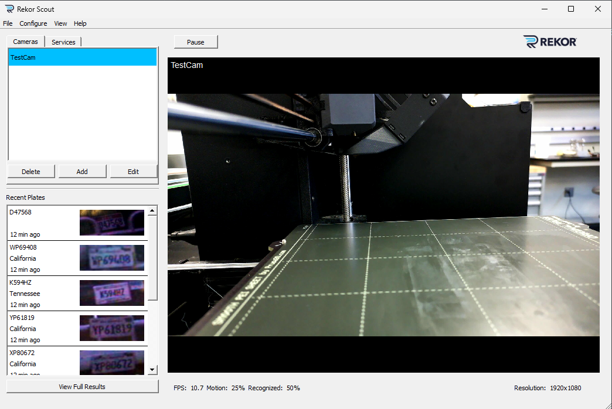
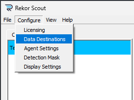
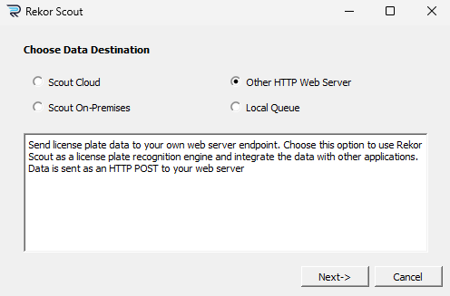

# ALPR

To use this, you first have to have an active [OpenALPR](https://cloud.openalpr.com/) account. Once you have a subscription, you only need two things: an IP camera (a camera that broadcasts it's feed over IP) and a Windows machine on the same network.

## Setting up the Camera

## Setting up the Rekor Server

## Running your own local dashboard

Once you have subscribed to OA's Rekor Scout, follow their instructions to download the client on Windows.

To connect the webserver to Rekor Scout:

Open Rekor Scount:

Click on the top left, **Configure >> Data Destinations**:

Click on Other HTTP Server:

Enter `http://localhost:5000/alpr` as the server URL:

