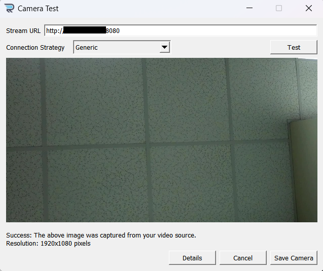

# 🚗 ALPR Local Dashboard

Welcome to your own **Automatic License Plate Recognition (ALPR) dashboard**! This project gives you a powerful, local alternative to Rekor Scout's online dashboard, letting you keep all your license plate data on your own computer instead of in the cloud.

> **🤖 AI-Powered Development**: This entire dashboard was created with Anthropic's Claude Sonnet AI as an experiment in AI-programming. Not a single line of human-written code exists - even this documentation was AI-generated!

## 📋 What You'll Need

Before getting started, make sure you have:

- ✅ **Active [OpenALPR](https://cloud.openalpr.com/) subscription** - You'll need a paid account to use Rekor Scout
- ✅ **IP Camera** - Any camera that broadcasts its feed over your network
- ✅ **Windows computer** - On the same network as your camera(s)
- ✅ **Basic networking knowledge** - Finding IP addresses and configuring ports

**📂 Repository Structure**: This branch contains the server-side dashboard. For camera software setup, switch to the `lite` branch.

---

## 🔧 Part 1: Setting Up Rekor Scout (Windows)

First, we'll get the official Rekor Scout software running on your Windows machine. This software does the actual license plate recognition.

### Step 1: Download and Install Rekor Agent

1. **Download the installer**: Visit [Rekor's download page](https://deb.openalpr.com/windows-agent/openalpr-agent-latest.exe) or go to their main website
2. **Run the installer**: Follow the installation wizard
3. **Sign in**: The installer will prompt you to sign in with your OpenALPR account credentials
4. **Launch the program**: After installation, you should see this interface:


### Step 2: Add Your Camera

Now we'll connect your IP camera to Rekor Scout:

1. **Click "Add Camera"** in the main interface
2. **Select camera type**: Choose `IP Camera (Manual)` from the dropdown
3. **Enter camera URL**: Use the format `http://<IP-ADDR>:<PORT>`
   - Replace `<IP-ADDR>` with your camera's IP address (e.g., `192.168.1.100`)
   - Replace `<PORT>` with your camera's port (usually `8080`)


### Step 3: Test Your Camera Connection

1. **Click "Test"** to verify the camera feed is working
2. **Skip credentials** if prompted (unless your camera requires authentication)
3. **Verify the feed**: You should see live video from your camera



### Step 4: Save and Activate

1. **Click "Save Camera"** once the test is successful
2. **Name your camera** (e.g., "Front Gate", "Parking Lot", etc.)
3. **Start services**: When prompted about starting Rekor services, **always click "Yes"** to prevent performance issues

🎉 **Success!** Your camera is now connected and Rekor Scout will automatically start detecting license plates. You can pause detection anytime using the pause button at the top of the interface.

---

## 🌐 Part 2: Setting Up Your Local Dashboard

Now for the exciting part - running your own local dashboard that keeps all data on your computer!

### Why Use a Local Dashboard?

- 📊 **Data Privacy**: All license plate data stays on your computer
- 🚀 **Performance**: Faster loading and no internet dependency
- 🛠️ **Customization**: Modify the dashboard to fit your needs
- 💰 **Cost Savings**: No additional cloud storage fees

### Step 1: Configure Your Dashboard

1. **Navigate to the server folder**: 
   ```bash
   cd path\to\alpr\server
   ```

2. **Copy the configuration template**:
   - Find the file named `config.template`
   - Make a copy and rename it to `config.yaml`

3. **Edit your configuration**:
   - Open `config.yaml` in any text editor
   - Add your camera IP addresses to the camera list
   - Adjust file paths and settings as needed
   - Save your changes

### Step 2: Set Up the Server Environment

We've made this super easy with an automated setup script:

```powershell
# One-time setup (installs Python, creates virtual environment, installs dependencies)
.\setup.ps1 setup

# Run the server (use this every time you want to start the dashboard)
.\setup.ps1 run
```

**Alternative manual method**:
```bash
python3.10 .\alpr_integrated_server.py
```

### Step 3: Access Your Dashboard

Once the server is running, open your web browser and visit:

- 🏠 **Main Dashboard**: `http://localhost:5000/dashboard`
- 📹 **Camera Grid View**: `http://localhost:5000/cameras`
- 📊 **API Endpoints**: `http://localhost:5000/api/plates`

Your dashboard will look like this:


---

## 🔗 Part 3: Connecting Rekor Scout to Your Local Server

Now we'll tell Rekor Scout to send all license plate data to your local dashboard instead of the cloud.

### Step 1: Open Data Destinations

1. **Open Rekor Scout** (if not already running)


2. **Navigate to settings**: Click **Configure → Data Destinations** in the top menu


### Step 2: Add Your Local Server

1. **Select server type**: Click on **"Other HTTP Server"**


2. **Enter server URL**: Type `http://localhost:5000/alpr` in the URL field


3. **Save the configuration**: Click "Save" or "Apply"

🎉 **You're all set!** Rekor Scout will now send all detected license plates to your local dashboard.

---

## 📁 Understanding Your Data

Your local server creates several files to organize the license plate data:

| File | Description |
|------|-------------|
| `alpr_raw_data.jsonl` | Complete JSON data from Rekor Scout (includes heartbeats) |
| `alpr_parsed_data.jsonl` | Clean license plate data only (customizable) |
| `event.log` | Human-readable event log |
| `plates/` folder | Cropped images of detected license plates |

All file names and locations can be customized in your `config.yaml` file.

---

## 🚀 Dashboard Features

Your local dashboard includes:

- 📊 **Real-time plate detection display**
- 🎥 **Live camera feeds** (single view and grid view)
- 🔍 **Search and filter capabilities**
- 📈 **Statistics and analytics**
- 🔄 **Auto-refresh functionality**
- 📱 **Mobile-responsive design**
- 🚨 **Real-time notifications for new detections**

---

## 🆘 Troubleshooting

### Camera Not Connecting?
- Verify your camera's IP address and port
- Make sure your camera and computer are on the same network
- Try accessing `http://<camera-ip>:8080` directly in your browser

### Server Won't Start?
- Make sure Python is installed (`python --version`)
- Run the setup script: `.\setup.ps1 setup`
- Check that port 5000 isn't being used by another application

### No License Plates Detected?
- Ensure Rekor Scout is running and not paused
- Verify the data destination is set to `http://localhost:5000/alpr`
- Check that your camera has a clear view of license plates

### Need More Help?
- Check the console output for error messages
- Visit the status page: `http://localhost:5000/stats`
- Review the `event.log` file for detailed information

---

## 🎯 Next Steps

Once everything is running:

1. **Test the system**: Drive a car past your camera to see license plate detection in action
2. **Explore the dashboard**: Try different views, filters, and sorting options
3. **Customize settings**: Modify `config.yaml` to fit your specific needs
4. **Add more cameras**: Repeat the camera setup process for additional monitoring points
5. **Monitor performance**: Use the built-in statistics to track system performance

Enjoy your new local ALPR dashboard! 🚗✨
